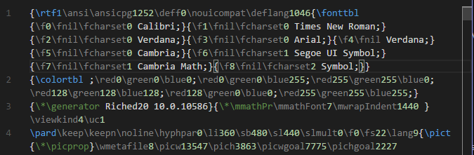

# RTF for Visual Studio Code

This extension adds support for RTF (Rich Text Format) language to Visual Studio Code, including:

* Colorization
* Bracket Matching

## Compatibility

The extension is based on a basic set of instructions defined in [RTF Specification version 1.9.1](https://www.microsoft.com/en-us/download/details.aspx?id=10725). New instructions will be added in upcoming updates.

# Changelog

## Version 0.2.0

* Fixed negative values in supported instructions
* Added Footnote instructions
* Added Default Font and Language instructions
* Added Special Characters instructions
* Added Alignment instructions

## Version 0.1.0

* Initial Release

## Participate

If you have any idea, feel free to create issues and pull requests

# License

[MIT](LICENSE.md) &copy; Alessandro Fragnani

---

 a :coffee: and you will help me to keep working on this extension :wink:

 um :coffee: e você vai me ajudar a continuar trabalhando nesta extensão :wink: